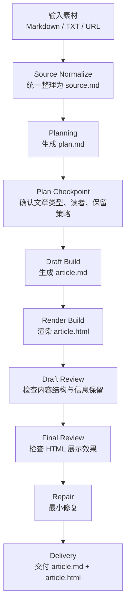

# Article Harness

一个 Markdown-first 的通用文章生成工作流，把零散素材稳定转成结构化主稿和可分享网页文章。

## 项目简介

我设计了一个通用文章生成 harness，用来解决“一次性 prompt 生成长文不稳定”的问题。这个系统先把素材统一整理成标准底稿，再经过规划、起稿、渲染和双层 review，最终同时产出可继续编辑的 `article.md` 和可直接展示的 `article.html`。

## 项目背景

在处理长文生成任务时，我发现传统的一次性 prompt 有几个明显问题：

- 输入来源不统一，URL、纯文本、Markdown 混在一起时容易漏信息
- 内容生成过程缺少中间状态，AI 很容易边写边漂
- 文章内容和 HTML 展示耦合太紧，后续难修改、难迁移
- 不同文章类型虽然需求不同，但往往没有统一的生产流程

所以我没有把它当成“写一篇文章”的问题，而是把它当成“设计一套文章生产系统”的问题。

## 核心方案

我把文章生成拆成一条可复用的工作流：

- 先统一输入，形成稳定事实底稿
- 再通过 `plan.md` 明确文章类型、读者、信息保留策略和结构
- 用 `article.md` 作为正文真身
- 再把主稿渲染成 `article.html`
- 最后把内容 review 和展示 review 分开处理

这个设计的关键点是：

`Markdown 是内容层，HTML 是展示层。`

## 流程图



## 框架目录

```text
workspace/
  source/
    source.md
    extraction-notes.md
  plan/
    plan.md
  draft/
    article.md
  render/
    article.html
  review/
    draft-review.md
    final-review.md
```

它们的职责分别是：

- `source/`：整理原始素材，建立统一事实底座
- `plan/`：记录文章类型、结构和写作策略
- `draft/`：保存 Markdown 主稿
- `render/`：保存 HTML 展示产物
- `review/`：分开记录内容 review 和展示 review

## 为什么它是 Harness

`Article Harness` 之所以叫 harness，不是因为它会生成文章，而是因为它管理了文章生成过程。它通过中间状态文件、规划阶段、类型路由、双层 review 和最小修复策略，把一次性 prompt 变成了一条可控的内容生产线。

## 关键设计决策

### Markdown 作为内容真身

我没有把 HTML 当成唯一产物，而是先产出 `article.md`。这让内容更容易修改、迁移，也更适合后续接入不同站点或渲染器。

### HTML 只做轻渲染增强

HTML 层只负责目录、摘要区、代码高亮、表格和引用块样式等阅读增强，不允许大幅改写正文结构。这样可以避免内容层和展示层脱节。

### 统一流程加类型路由

系统共用一条主流程，但在 planning 阶段分流为 `explainer`、`tutorial`、`review`、`briefing`、`longform` 五种文章类型。这样既通用，又不会把所有文章都写成一个样子。

### 双层 Review

我把 review 拆成：

- `draft-review`：检查 Markdown 内容结构和信息保留
- `final-review`：检查 HTML 展示和阅读体验

这样可以把“内容问题”和“展示问题”分开处理，减少无意义返工。

## 项目总结

`Article Harness` 是我对“通用文章生成”这件事的一次系统化设计尝试。相比一次性 prompt，它更强调流程控制、状态管理、类型路由和内容可迁移性，把内容生成从“临时结果”推进成了一套可复用方法。
