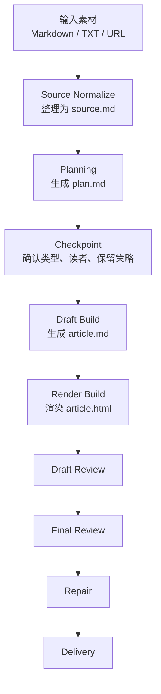

# Hero

## Article Harness

一个 Markdown-first 的通用文章生成工作流，把零散素材稳定转成结构化主稿和可分享网页文章。

我把文章生成从一次性 prompt，改造成了一套可控、可追踪、可修复的内容生产系统。当前版本采用单 agent 主流程，以保证文章结构、语气和信息保留的一致性；同时预留了多 agent review 的扩展空间，用于后续拆分内容审查和展示审查。

**标签**

- AI Workflow
- Markdown-first
- Content System
- HTML Rendering
- Harness Design

# System Overview

我没有把这个项目当成“写一篇文章”的问题，而是把它当成“设计一套文章生产系统”的问题。它的目标不是让模型一次性生成更长的内容，而是让生成过程更稳定、更可复用，也更容易检查和修复。

**统一输入**

系统先把 `Markdown`、`TXT`、`URL` 这几类输入整理成统一底稿 `source.md`，避免模型在不同格式之间来回切换，降低漏信息和误读的风险。

**规划先行**

在起稿之前，系统先生成 `plan.md`，明确文章类型、目标读者、信息保留策略、结构和语气。这样正文不是“边想边写”，而是沿着一个已经定义好的方向推进。

**双产物输出**

正文主稿保存为 `article.md`，最终展示成品输出为 `article.html`。Markdown 负责承载内容，HTML 负责承载展示，这样内容和展示可以清晰分层。

**双层质检**

系统把 review 分成内容层和展示层。先检查 Markdown 主稿的结构、保留策略和表达是否成立，再检查 HTML 的可读性、层级和展示效果是否清楚。

# Workflow



这套流程保留了 planning、checkpoint、review 和 repair 这些关键阶段，因此它更像一个受控生产系统，而不是一次性生成。它的重点不是“尽快吐结果”，而是让每一步都有明确职责，并且在出错时知道应该回到哪一层修复。

# Structure

```text
workspace/
  source/
  plan/
  draft/
  render/
  review/
```

这套目录结构对应的是整个流程里的五个状态层：

- `source/`：整理素材，建立统一事实底稿
- `plan/`：定义文章类型、结构和写作策略
- `draft/`：保存 Markdown 主稿
- `render/`：保存 HTML 展示产物
- `review/`：分开记录内容和展示 review

我刻意把关键状态写进文件，而不是依赖聊天上下文记忆。这样做的好处是，文章生成过程不再只是模型临场发挥，而是有稳定中间状态可追踪、可复查、可恢复。

# Why It Is A Harness

`Article Harness` 之所以叫 harness，不是因为它会生成文章，而是因为它管理了文章生成过程。它通过中间状态文件、规划阶段、类型路由、双层 review 和最小修复策略，把一次性 prompt 变成了一条可控的内容生产线。

# Key Decisions

## Markdown 是内容真身

我没有把 HTML 当成唯一产物，而是先产出 `article.md`。这样文章内容本身保持可编辑、可迁移，也更容易复用于其他站点、渲染器或发布场景。

## HTML 只做轻渲染增强

HTML 层负责目录、摘要区、代码高亮、表格和引用块样式等阅读增强，但不允许大幅改写正文结构。这样可以避免内容层和展示层脱节，也让 `article.md` 始终保持权威性。

## 统一流程加类型路由

系统共用一条主流程，但在 planning 阶段分流为 `explainer`、`tutorial`、`review`、`briefing`、`longform` 五种文章类型。这样既保证了工作流统一，又不会把所有文章都写成同一种结构。

## 双层 Review

我把 review 拆成两层：`draft-review` 负责检查 Markdown 主稿的内容结构和信息保留，`final-review` 负责检查 HTML 展示和阅读体验。这样可以把“内容问题”和“展示问题”分开处理，减少无意义返工。

# Closing

`Article Harness` 不是一个单次写作 prompt，而是一套可复用的文章生产系统。相比一次性生成，它更强调流程控制、状态管理，以及内容层和展示层的清晰分离。这个项目的重点不只是“生成文章”，而是把文章生成变成一个稳定、可追踪、可修复的过程。
