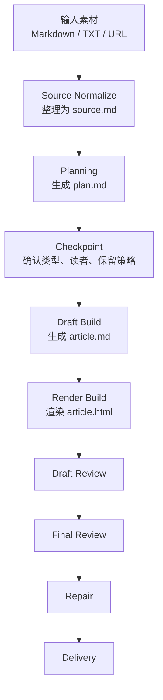

# Article Harness

一个 Markdown-first 的通用文章生成工作流，把零散素材稳定转成结构化主稿和可分享网页文章。

## 项目简介

我设计了一个通用文章生成 harness，用来解决“一次性 prompt 生成长文不稳定”的问题。系统先统一素材，再规划结构，接着生成 Markdown 主稿，最后渲染成 HTML，并通过双层 review 保证内容和展示都不跑偏。

## 核心流程



## 框架目录

```text
workspace/
  source/
  plan/
  draft/
  render/
  review/
```

- `source/`：整理素材，建立统一事实底稿
- `plan/`：定义文章类型、结构和写作策略
- `draft/`：保存 Markdown 主稿
- `render/`：保存 HTML 展示产物
- `review/`：分开记录内容和展示 review

## 为什么它是 Harness

`Article Harness` 之所以叫 harness，不是因为它会生成文章，而是因为它管理了文章生成过程。它通过中间状态文件、规划阶段、类型路由、双层 review 和最小修复策略，把一次性 prompt 变成了一条可控的内容生产线。

## 关键设计

- `article.md` 是内容真身，保证文章可编辑、可迁移
- `article.html` 只做轻渲染增强，不改写正文结构
- 同一条主流程支持 `explainer`、`tutorial`、`review`、`briefing`、`longform`
- 当前版本采用单 agent 主流程，同时预留多 agent review 的扩展空间

## 总结

这个项目不是在做一个单次写作 prompt，而是在设计一套可复用的文章生产系统。相比一次性生成，它更强调流程控制、状态管理和内容与展示分层。
