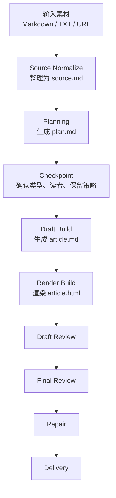

# Hero

## Article Harness

一个 Markdown-first 的通用文章生成工作流，把零散素材稳定转成结构化主稿和可分享网页文章。

当前版本采用单 agent 主流程，以保证文章结构、语气和信息保留的一致性；同时预留了多 agent review 的扩展空间，用于后续拆分内容审查和展示审查。

# Problem

传统的一次性 prompt 在长文生成场景里有几个明显问题：

- 输入来源不统一，URL、纯文本、Markdown 混在一起时容易漏信息
- 生成过程缺少中间状态，内容容易边写边漂
- 内容和 HTML 展示耦合太紧，后续难修改、难迁移
- 不同文章类型缺少统一但可复用的生产流程

我希望把“生成一篇文章”从一次性结果，变成一个可控、可追踪、可修复的生产过程。

# Solution

我把文章生成拆成一条可复用工作流：

- 先统一输入，整理成稳定事实底稿
- 再通过 `plan.md` 确认文章类型、读者、保留策略和结构
- 以 `article.md` 作为正文真身
- 再把主稿渲染成 `article.html`
- 最后分开处理内容 review 和展示 review

这个系统的核心原则是：

`Markdown 是内容层，HTML 是展示层。`

# Workflow



# Structure

```text
workspace/
  source/
  plan/
  draft/
  render/
  review/
```

- `source/`：整理素材，建立统一事实底稿
- `plan/`：定义文章类型、结构和写作策略
- `draft/`：保存 Markdown 主稿
- `render/`：保存 HTML 展示产物
- `review/`：分开记录内容和展示 review

# Why It Is A Harness

`Article Harness` 之所以叫 harness，不是因为它会生成文章，而是因为它管理了文章生成过程。它通过中间状态文件、规划阶段、类型路由、双层 review 和最小修复策略，把一次性 prompt 变成了一条可控的内容生产线。

# Key Decisions

- `article.md` 是内容真身，保证文章可编辑、可迁移
- `article.html` 只做轻渲染增强，不改写正文结构
- 同一条主流程支持 `explainer`、`tutorial`、`review`、`briefing`、`longform`
- review 拆成内容层和展示层，避免混在一起返工

# Outcome

这个项目不是在做一个单次写作 prompt，而是在设计一套可复用的文章生产系统。相比一次性生成，它更强调流程控制、状态管理，以及内容层和展示层的清晰分离。
